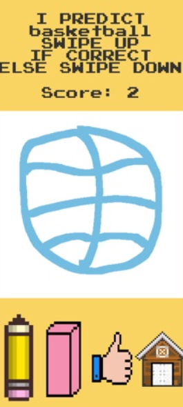

# Smart Draw

See if the AI can guess your drawing! If you draw well enough, you earn points! Else, you lose all your points!

This fun game allows you to see how well you can draw. Given three topics, choose the one you are most familiar with and draw it. If the AI recognizes it, you earn points. Otherwise, you lose all your points.

 I made this during the my Junior year of high school (Fall 2019).
[Download on the app store!](https://apps.apple.com/us/app/smartdraw/id1468990421)

SIMPLE GAMEPLAY

Just click play and follow the directions on the screen.

CUSTOMIZE

You can change the color of the pen to whatever color you wish, such as Sarcoline, Smaragdine, or Mikado (yes, these are actual colors).

STATISTICS

The game keeps track of how well you have drawn.

VARIOUS TOPICS

There are many topics to choose from when drawing.

HOW THE AI WORKS

The AI consists of a neural network that has been trained on thousands of drawings by people all over the world. This allows it to classify your drawings with high accuracy.

Overall, all that matters is you have fun while seeing how well you can draw!

## RUN GAME LOCALLY

To run the game locally, download this project and run it in [Unity](https://unity.com/). The AI opponent in this game is a neural network created from scratch in Python and trained on the [Google Quick Draw Game dataset](https://github.com/googlecreativelab/quickdraw-dataset).

## CONCEPTS

- Neural Networks
- Image Classification

